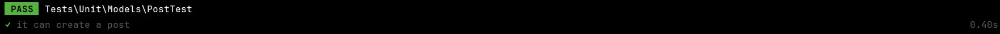

(I deleted vendor folder for this ZIP folder)
### DevOps 3

### Security 3

### Testing
To start this testing, I started by testing the connection with the database.

Figure 1: MariaDB connection.

Then, I did migrate fresh and seed the previous created posts to test the database.

Figure 2: php artisan migrate:fresh & php artisan db:seed.

# User Story 1: Post Creation and Update Management (Feature Test)
As a user, I want to create and update posts on the platform.

## System Test Scenarios:
### Happy Path:

* Creating a New Post:
 **Given** a user wants to create a new post,
 **When** they fill out the post creation form with valid data and submit it,
 **Then** a new post should be stored in the database.
* Updating an Existing Post:
 **Given** a user wants to update an existing post,
 **When** they edit the post details and save the changes,
 **Then** the post should reflect the updated information in the database.

### Unhappy Paths:

* Creating a Post with Invalid Data:
 **Given** a user tries to create a new post with incomplete or invalid data,
 **When** they submit the form,
 **Then** an error message should prevent the creation of the post.

* Updating a Post with Incorrect Information:
 **Given** a user attempts to update a post with incorrect information,
 **When** they save the changes,
 **Then** the post data should remain unchanged in the database.

## Unit Test Scenarios:
### Post Creation:

* **Given** a new Post model instance,
* **When** a new post is created using Post::create(),
* **Then** the post should be successfully stored in the database with the correct attributes.

Figure 3: unit test create a new post.

Figure 4: feature test stores a new post.

### Post Update:

* **Given** an existing Post instance,
* **When** the post is updated using Post::update(),
* **Then** the post data should reflect the updated attributes.

Figure 5: unit test updates the post.

Figure 6: feature test updates the post.

### Tests Coverage Rationale:
* **System Tests:** Validate critical user-facing functionalities related to post creation and update.
* **Unit Tests:** Ensure core model functionalities related to data manipulation are correctly implemented.

### Test Execution:
* **System Tests:** Validate integrated features from the user interface to the database layer.
* **Unit Tests:** Validate individual model functionalities and database interactions.

### Evaluation of Test Quality:
* **Conclusion on Test Results:** Critical functionalities related to post creation and update are verified to function correctly.
* **Improvement Proposal:** Enhance test coverage by incorporating more edge cases and integrating automated testing with continuous integration tools.

# User Story 2: Post Deletion Management (Feature Test)
As a user, I want to delete posts on the platform.

## System Test Scenarios:
### Happy Path:
* Deleting an Existing Post:
 **Given** a user wants to delete an existing post,
 **When** they confirm the deletion action,
 **Then** the post should be permanently removed from the database.

### Unhappy Paths:
* Deleting a Non-Existent Post:
 **Given** a user tries to delete a post that does not exist,
 **When** they initiate the deletion process,
 **Then** no action should be taken, and the post should still exist.

## Unit Test Scenarios:
### Post Deletion:
* **Given** an existing Post instance,
* **When** the post is deleted using $post->delete(),
* **Then** the post should be removed from the database.

Figure 7: unit test delete the post.

Figure 8: feature test delete the post.

### Tests Coverage Rationale:
* **System Tests:** Validate critical user-facing functionalities related to post deletion.
* **Unit Tests:** Ensure core model functionalities related to data manipulation are correctly implemented.

### Test Execution:
* **System Tests:** Validate integrated features from the user interface to the database layer.
* **Unit Tests:** Validate individual model functionalities and database interactions.

### Evaluation of Test Quality:
* **Conclusion on Test Results:** Critical functionalities related to post deletion are verified to function correctly.
* **Improvement Proposal:** Enhance test coverage by incorporating more edge cases and integrating automated testing with continuous integration tools.

# Final testing

Figure 9: php artisan test to test everything.

